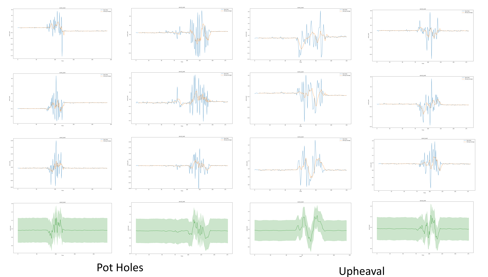
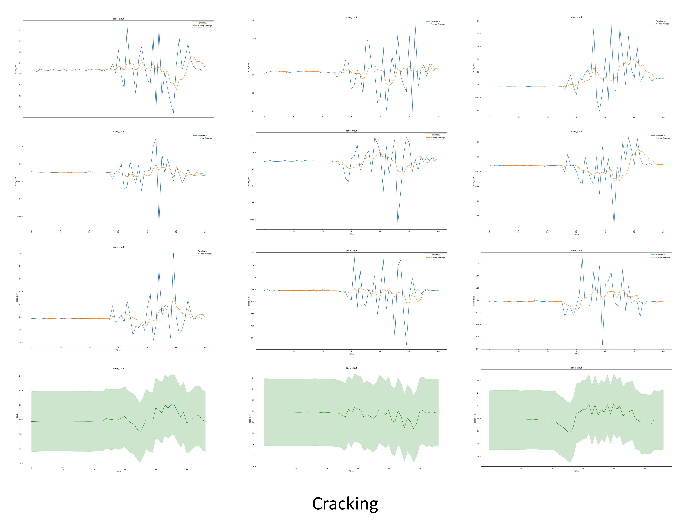

# Patrolman: Using Raspberry Pi for Road Pothole Inspection

• [Pengkun Liu](pengkunl@andrew.cmu.edu); [Ruoxin Xiong](ruoxinx@andrew.cmu.edu)

## Video link: [http://www.youtube.com/watch?v=wE4p8kOEM_Y](http://www.youtube.com/watch?v=wE4p8kOEM_Y)


## 1 Introduction

Road potholes are common defects for aging civil infrastructures around the world. For example, in 2017, more than half a million potholes have been reported to local departments in the UK [1]. The massive amounts of road potholes require additional maintenance capital for the traffic department. Edmonton in Canada spent $4.8 million on repairing 450,000 potholes in 2015 [2]. The bad road conditions also pose discomfort and even hazards to vehicle drivers or commuters, especially under high speed or low visibility conditions. For instance, approximately 1,100 people died due to serious traffic accidents caused by road potholes in India [3]. This project designs and implements a mobile Raspberry Pi system called Patrolman for road pothole inspection.


Image source:[Pothole - Wikipedia](https://en.wikipedia.org/wiki/Pothole#cite_note-13)

### 1.1 Motivation

Reliable routine monitoring and assessments of road conditions can lead to timely preventive action. The traditional approach to road damage detection is to use manual reporting of the road potholes. Due to the significant scale of the roadway networks, this method is typically unavailable in terms of labor and cost. Considering that road conditions can be reflected and measured in vibrations [4], the team designs a mobile Raspberry Pi system - Patrolman, for road pothole inspection. The Patrolman system makes use of the mobility of cars (we use a toy car) to collect the vibration signals during a drive.

### 1.2 Goals

This project presents a mobile system – Patrolman, using Raspberry Pi to detect and report road potholes with their georeferenced locations. The patrolman system uses the vehicles' mobility, continually gathering data from the accelerometer and GPS sensors and processing the collected signals to evaluate road surface conditions.

## 2 For Progress Reports

#### [Progress Report_Oct 5th](https://github.com/xiongrxchn/IntelBri.github.io/blob/gh1-pages/progress_report_1.md)
#### [Progress Report_Oct 8th](https://github.com/xiongrxchn/IntelBri.github.io/blob/gh1-pages/progress_report_2.md)
#### [Progress Report_Oct 15th](https://github.com/xiongrxchn/IntelBri.github.io/blob/gh1-pages/progress_report_3.md)
#### [Progress Report_Oct 17th](https://github.com/xiongrxchn/IntelBri.github.io/blob/gh1-pages/progress_report_4.md)


## 3 Methodology

### 3.1 Phenomena of Interest

The vibration patterns sensed by the driving cars actually reflect the road conditions being monitored [4]. The general sensing signals intended to assess road conditions include:

1. Vibration - Acceleration is the common measurement in characterizing vibrations. When the participating vehicles move on smooth roads, the acceleration values (g) are typically steady, while acceleration may show fluctuated signals when driving on bad road conditions with potholes.

2. Georeferenced locations - We also use the GPS module to record the trajectory of the moving vehicles. Therefore, we can report the georeferenced locations for each identified road pothole.

### 3.2 Sensor(s) Used

In this project, the team leverages and collects signals from sensors mounted on a testing vehicle (we use a toy car instead). The Patrolman system consists of Raspberry Pi, MPU-6050 six-axis accelerometers, GPS, and a power bank for power supply. 

  - Accelerometer: MPU-6050 Six-Axis (Gyro + Accelerometer) MEMS

The MPU6050 sensor is a 6-axis Motion Tracking module, which combines 3-axis Gyroscope and 3-axis Accelerometer. The features and specifications of this sensor (descriptions from [wiki](https://www.electronicwings.com/sensors-modules/mpu6050-gyroscope-accelerometer-temperature-sensor-module)) are shown below:

#### Features and Specifications
```markdown
  - Tri-Axis angular rate sensor with a sensitivity up to 131 LSBs/dps and a full-scale range of ±250, ±500, ±1000, and ±2000dps
  - Tri-Axis accelerometer with a programmable full-scale range of ±2g, ±4g, ±8g and ±16g
  - VDD Supply voltage range of 2.375V – 3.46V 
  - VLOGIC (MPU-6050) at 1.8V ± 5% or VDD
  - Gyroscope readings are in degrees per second (dps) unit; Accelerometer readings are in g unit.
```

  - GPS sensor: L76X GPS Module

L76X GPS Module, as a common Global Navigation Satellite System (GNSS) module, supports Multi-GNSS systems, such as Global Positioning System (GPS), Quasi-Zenith Satellite System (QZSS), and BeiDou Navigation Satellite System (BDS) [5]. The features and specifications of this sensor (descriptions can be referred to [L76X GPS Module User Manual](https://www.waveshare.com/w/upload/5/5b/L76X_GPS_Module_user_manual_en.pdf)) are shown below:

#### Features
```markdown
  - Supports Multi-GNSS systems: GPS, BDS, and QZSS
  - EASY™, self-track prediction technology, help quick positioning
  - AlwaysLocate™, intelligent controller of periodic mode for power saving
  - Onboard rechargeable Li-battery MS621FE, for preserving ephemeris information and hot starts
  - 2x LEDs for indicating the module working status
  - Comes with development resources and manual (examples for Raspberry Pi/Arduino/STM32)
```

#### GNSS Specifications
```markdown
  - Horizontal position accuracy:
    - Autonomous: <2.5mCEP
  - Time-To-First-Fix @-130dBm (EASY™ enabled):
    - Cold starts: <15s
    - Warm starts: <5s
    - Hot starts: <1s
  - Sensitivity:
    - Acquisition: -148dBm
    - Tracking: -163dBm
    - Re-acquisition: -160dBm
  - Dynamic performance:
    - Altitude (max): 18000m
    - Velocity (max): 515m/s
    - Acceleration (max): 4G
```

#### General Specifications
```markdown
  - Baudrate: 4800~115200bps (9600bps by default)
  - Update rate: 1Hz (default), 10Hz (max)
  - Power supply voltage: 5V / 3.3V
  - Operating current: 11mA
  - Dimensions: 32.5mm x 25.5mm
```

#### Development Resources

The detailed reference materials are from Wiki: [www.waveshare.com/wiki/L76X_GPS_Module](www.waveshare.com/wiki/L76X_GPS_Module)

### 3.3 Signal Conditioning and Processing

#### Sampling frequency

The current operating system of Raspberry Pi uses the Linux kernels, which do not support real-time. So the Raspberry Pi cannot generate real-time pulses to control high-frequency sensors in the experiments.

  - Accelerometer: The accelerator sensor is installed on the moving cars to test its vibration on the z-axis. To determine the limitation of the Raspberry Pi system, the team uses different sampling frequencies and conducts a host of pre-experiments. The team counts the actual sampling time for receiving 300 signals and compares it with the theoretical values.

 In the experiments, the sampling frequencies of the Accelerometer are tested for 1Hz, 2Hz, 5Hz, 10Hz, 20Hz, 50Hz, 100Hz and 200Hz. 
 
| Sampling frequency | 1Hz | 2Hz | 5Hz | 10Hz | 20Hz | 50Hz | 100Hz | 200Hz |
| :----: | :----: | :----:| :----: | :----:|:----: | :----:| :----:| :----:|
| Theoretical Signal received | 300 | 300 | 300 | 300 | 300 | 300 | 300 | 300 |
| Theoretical sampling time (s) | 300 | 150 | 60 | 30 | 15 | 6 | 3 | 1.5 |
| Actual sampling time (s) | 301 | 151 | 62 | 32 | 17 | 8 | 5 | 3 |
| Error rate (%) | 0.33 | 0.67 | 3.33 | 6.67 | 13.33 | 33.33 | 66.67 | 100 | 

In particular, when the sampling frequency of the accelerometer reaches 200Hz, some data points are collected with zero values with an error rate of 100%. Here, the team uses 10Hz as the sampling frequency of the accelerometer in the experiments.

 

  - GPS sensor: The GPS module's max frequency is 10Hz, and the default frequency is 1 Hz. Here, the team uses the default frequency - 1Hz as the sampling frequency of the GPS sensor due to the low speed of our system.
  
#### Absent values of sensors

The sensors, including the GPS module and accelerometer, often miss some signals or receive zero readings during the experiments. For example, when passing through bridges, closed buildings, or tunnels, the GPS module may lose the satellites' connections. In our experiments, we use linear interpolation to the missing values between GPS readings due to the testing cars' low speed. Similarly, for the accelerometer's zero readings, the team also fills the missing values with linear interpolation.

#### Signal smoothing

To uncover and identify the signal patterns of acceleration data, the team applies the moving average method to smooth the accelerometer signals and remove noisy vales to reflect the overall trends.

### 3.4 Pavement defect patterns

The team focused on collecting a diverse set of samples, including the following event classes [6]:

  - Smooth road (SM): Good road conditions with smooth pavements.
  
  - Potholes (PH): Missing chunks of the pavements.
  
  - Upheaval (UH): Localized upward swelling on the roads.
  
  - Cracking (CR): Road cracks often result from frequent vehicle movements and temperature changes.


Image source: [https://www.pavemanpro.com/article/identifying_asphalt_pavement_defects/](https://www.pavemanpro.com/article/identifying_asphalt_pavement_defects/)

## 4 Experiments and Results

### Data collection

  - Getting hardware
  
We have purchased Raspberry Pi and sensors (GPS module and MPU-6050 accelerometer) from [Taobao](https://www.taobao.com/).

  - Set up the test environment
  
We have built the sensors and written Python codes to monitor the parameters based on the tutorials. The sampling frequencies of the MPU-6050 accelerometer and GPS module are 10 Hz and 1 Hz, respectively.


  - GPS module test results

    - Hardware connection
    
Connect L76X GPS module to the board. Four pins are used: VCC, GND, TX, and RX [5].

| L76X GPS Module  | Raspberry Pi (Board)  | Raspberry Pi (BCM) |
| :----: | :----: | :----:|
| VCC | 5v | 5 |
| GND | GND | GND |
| TX | 10 | P15 |
| RX | 8 | P14 |

   - Running code

Run the test code [GPS.py](https://github.com/xiongrxchn/IntelBri.github.io/blob/gh1-pages/code/GPS.py). The test results are shown as follows:


- MPU 6050 sensor test results

  - Hardware connection
  
Connect the MPU 6050 sensor to the board. Four pins are available for use: VCC, GND, SDA, and SCL [8].

| MPU 6050 | Raspberry Pi (Board) |
| :----: | :----: |
| VCC | 3.3v |
| GND | GND |
| SDA | P3 |
| SCL | P5 |

   - Running code

Run the test code [Acceleration.py](https://github.com/xiongrxchn/IntelBri.github.io/blob/gh1-pages/code/Acceleration.py). The test results are shown as follows:


### Indoor experiments

#### Patrolman system desgin

We design the Patrolman system, using Raspberry Pi to detect and report road potholes with their georeferenced locations. The system consists of a mobile platform (we use the toy car in the experiments), an MPU-6050 accelerometer, and a GPS sensor. Also, we use the power bank to supply the power of the system.


#### Indoor testing results

For the indoor experiments, the adopted sensors communicate the collected vibration data to the PC via a Wi-Fi router.


Test results of the Z-axis acceleration show significant patterns when the car crosses over the road obstacle compared to the smooth road surface.


#### Set up IoT device

Following the [tuturial](https://inferlab.github.io/12740/tutorials/openchirp.html), we create a device named "Patrolman" on [OpenChirp](https://openchirp.io/).


##### Transducers

| Name  | Unit | Actuable |
| :----: | :----: | :----:|
| accel_x | g | false |
| accel_y | g | false |
| accel_z | g | false |
| lat | degree | false |
| lon | degree | false |

We then publish sensor readings onto OpenChirp, which can timely report and visualize data on the website. 

See [acc_openchirp.py](https://github.com/xiongrxchn/IntelBri.github.io/blob/gh1-pages/code/acc_openchirp.py)and [gps_openchirp.py](https://github.com/xiongrxchn/IntelBri.github.io/blob/gh1-pages/code/gps_openchirp.py) for the code.


### Outdoor experiments

Our experimental works were conducted separately in Zhangzhou and Nanjing, China. The team collects the hand-labeled signals by continuously moving several known roads and recording raw accelerometer and GPS data. Using mobile phone's network hotspots, we control the Raspberry Pi with a remote-control app [Anydeck](https://anydesk.com/) and communicate the collected accelerometer and GPS signals to the OpenChirp.


### Pothole detection

The motivation behind our system is that anomalous road conditions are reflected in features of the acceleration data.


After collecting and cleaning all the data sets, we draw the figures of three kinds of defects. The figures are about the X-axis acceleration, Y-axis acceleration, Z-axis acceleration, and the corresponding moving averages. 95% confidence interval of the Z-axis acceleration of three kinds of defects are also drawn. Different defects have different data distributions and patterns. As for the acceleration duration, the Pot Holes have the shortest period, especially multiple massive changes in amplitude in a short time. The durations of acceleration of the Cracking last for the longest time, but the variation range of acceleration is more moderate compared to the Pot Holes. The changing pattern of acceleration for the Upheaval is somewhere between the Pot Holes and Cracking.





To analyze the patterns of different signals, Short-time Fourier transform (STFT) is used to divide the long Z-axis acceleration signal into short parts and calculate the Fourier transform on each part to get the complex frequency, amplitude, and phase content of the Z-axis acceleration signal developing with time. As shown in the figure, the Y-axis is the frequency (Hz) of the Z-axis acceleration signal, and the X-axis is time (s). The time-frequency distributions (amplitude spectrogram) of the Z-axis acceleration signal vary between the Upheaval, Potholes, and Cracking.


## 5 Discussion

- This project designs and implements the patrolman system, using Raspberry Pi for road pothole inspection. The system consists of a mobile platform (we use the toy car in the experiments), an MPU-6050 accelerometer, a GPS sensor, and a power bank. By continually gathering data from the accelerometer and GPS sensors, the team uses collected signals to evaluate road surface conditions.

- We focus on analyzing three typical types of road conditions, including Cracks (CR), Potholes (PH), and Upheaval (UH). Anomalous road conditions are reflected in features of the acceleration data. Comparing different hand-labeled signal patterns, the team identifies the features of different road conditions.

- In the future, we will apply a machine-learning based approach for automatic detection of diverse road conditions.

## References

[1] Editor, Swindonian (2018). ["More than half a million potholes were reported last year throughout the UK"](https://media.rac.co.uk/pressreleases/more-than-half-a-million-potholes-reported-to-councils-in-2017-2818923#:~:text=More%20than%20half%20a%20million%20potholes%20were%20reported%20by%20members,data%20obtained%20by%20the%20RAC.). The Swindonian.

[2] Hingston, Michael (2015). "Asphalt Nerds The alchemy of pavement in Canada's pothole capital". The Walrus.

[3] Kamaljit Kaur S., (2018). "Over 9300 deaths, 25000 injured in 3 years due to potholes". India Today. 

[4] Eriksson, J., Girod, L., Hull, B., Newton, R., Madden, S., & Balakrishnan, H. (2008). The Pothole Patrol: Using a mobile sensor network for road surface monitoring. In MobiSys’08 - Proceedings of the 6th International Conference on Mobile Systems, Applications, and Services (pp. 29–39).

[5] L76X GPS Module User Manual. [https://www.waveshare.com/w/upload/5/5b/L76X_GPS_Module_user_manual_en.pdf](https://www.waveshare.com/w/upload/5/5b/L76X_GPS_Module_user_manual_en.pdf).

[6] Brett Neal, 13 Pavement Defects and Failures You Should Know. [https://www.pavemanpro.com/article/identifying_asphalt_pavement_defects/](https://www.pavemanpro.com/article/identifying_asphalt_pavement_defects/).

[7] Simple Device Tutorial, [https://github.com/OpenChirp/docs/wiki/simple-device-tutorial](https://github.com/OpenChirp/docs/wiki/simple-device-tutorial).

[8] MPU6050 (Gyroscope + Accelerometer + Temperature) Sensor Module, [https://www.electronicwings.com/sensors-modules/mpu6050-gyroscope-accelerometer-temperature-sensor-module](https://www.electronicwings.com/sensors-modules/mpu6050-gyroscope-accelerometer-temperature-sensor-module). 
