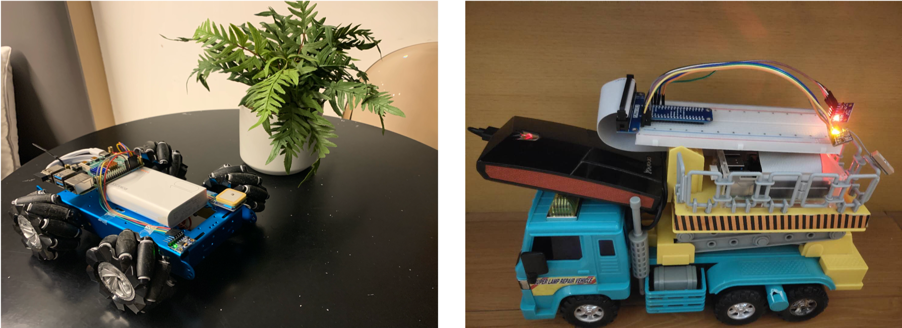
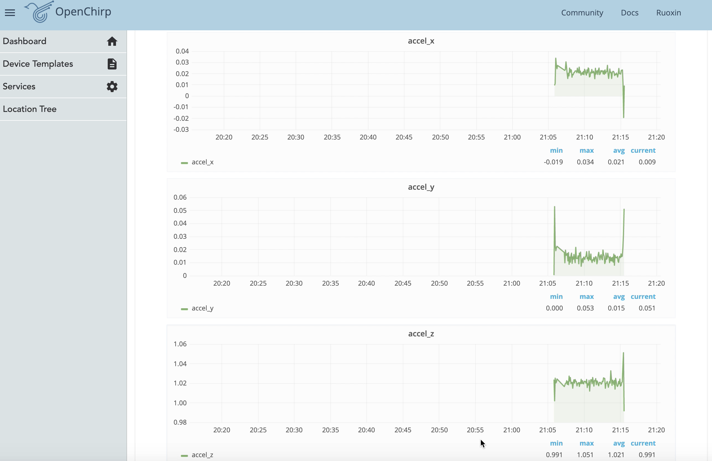

# Patrolman: Using Raspberry Pi for Road Pothole Inspection

• [Pengkun Liu](pengkunl@andrew.cmu.edu); [Ruoxin Xiong](ruoxinx@andrew.cmu.edu)

## Video link: [http://www.youtube.com/watch?v=wE4p8kOEM_Y](http://www.youtube.com/watch?v=wE4p8kOEM_Y)


## 1 Introduction

Road potholes are a common nuisance experienced by vehicle drivers or commuters. In the United Kingdom, more than half a million potholes were reported in 2017, an increase of 44% in 2015 [1]. The self-proclaimed pothole capital, Edmonton, Alberta, Canada, reportedly spends $4.8 million on 450,000 potholes annually, as of 2015 [2]. Serious road accidents can occur due to surface potholes, especially under high speed or low visibility conditions. Every year India loses approximately 1,100 people to accidents caused by potholes [3]. This project designs and implements a mobile Raspberry Pi system called Patrolman for road pothole inspection.


Image source:[Pothole - Wikipedia](https://en.wikipedia.org/wiki/Pothole#cite_note-13)

### 1.1 Motivation

Reliable and cost-effective routine monitoring of road conditions can lead to timely preventive action. The traditional approach to road damage detection is to use manual reporting of potholes on the roads. Due to the sheer size of the roadway networks, manual inspections are typically unavailable in labor and cost. Road conditions are naturally sensed from a moving entity that can measure vibrations and impulses during a drive [4]. We design a mobile Raspberry Pi system - Patrolman, for road pothole inspection. Patrolman uses the six-axis accelerometer and GPS sensor deployed on the Raspberry Pi system, relying on cars' mobility (we use a toy car) to sense the vibration response of the roads being monitored.

### 1.2 Goals

This project presents an mobile system – Patrolman, using Raspberry Pi to detect and report road potholes with their georeferenced locations. It uses the participating vehicles' mobility, gathering data from the six-axis accelerometer and GPS sensors, and processing the data to assess road surface conditions. This project will provide an affordable sensing method to conduct pavement condition assessments.

## 2 For Progress Reports

#### [Progress Report_Oct 5th](https://github.com/xiongrxchn/IntelBri.github.io/blob/gh1-pages/progress_report_1.md)
#### [Progress Report_Oct 8th](https://github.com/xiongrxchn/IntelBri.github.io/blob/gh1-pages/progress_report_2.md)
#### [Progress Report_Oct 15th](https://github.com/xiongrxchn/IntelBri.github.io/blob/gh1-pages/progress_report_3.md)
#### [Progress Report_Oct 17th](https://github.com/xiongrxchn/IntelBri.github.io/blob/gh1-pages/progress_report_4.md)


## 3 Methodology

### 3.1 Phenomena of Interest

Road conditions are naturally sensed from a moving entity that can measure vibrations and impulses during a drive [4]. The general monitoring metrics intended to measure road condition and performance including:

1. Vibration - Acceleration is the most common measure taken to characterize vibrations. When the vehicle drive on flat road conditions, the three x, y, and z gravity of acceleration values (g) were steady while the three x, y, and z gravity of acceleration values (g) reflect pulse signals on thhe road with potholes.

2. Georeferenced locations - GPS is linked to each accelerometer for data to be georeferenced. Therefore, we record the locations of detected road potholes.

### 3.2 Sensor(s) Used

The Patrolman system consists of Raspberry Pi, MPU-6050 six-axis accelerometers, GPS, and a battery. In this project, the team collects vehicles' driving data (we use a toy car instead) and leverages sensors mounted on a testing vehicle.

  - Accelerometer: MPU-6050 Six-Axis (Gyro + Accelerometer) MEMS

The MPU6050 sensor module is a complete 6-axis Motion Tracking Device. It combines 3-axis Gyroscope, 3-axis Accelerometer, and Digital Motion Processor all in a small package. Also, it has an additional feature of the on-chip Temperature sensor. It has an I2C bus interface to communicate with the microcontrollers.

#### Features and Specifications
```markdown
  - Tri-Axis angular rate sensor with a sensitivity up to 131 LSBs/dps and a full-scale range of ±250, ±500, ±1000, and ±2000dps
  - Tri-Axis accelerometer with a programmable full scale range of ±2g, ±4g, ±8g and ±16g
  - VDD Supply voltage range of 2.375V – 3.46V 
  - VLOGIC (MPU-6050) at 1.8V ± 5% or VDD
  - Gyro operating current: 3.6mA (full power, gyro at all rates)
  - 400kHz Fast Mode I²C or up to 20MHz SPI serial host interfaces
  - Gyroscope readings are in degrees per second (dps) unit; Accelerometer readings are in g unit.
```

  - GPS sensor: L76X GPS Module

L76X GPS Module is a general Global Navigation Satellite System (GNSS) module which supports Multi-GNSS systems: GPS, BDS, and QZSS, with advantages such as small size, fast positioning, high accuracy, and low power consumption.

#### Features
```markdown
  - Supports Multi-GNSS systems: GPS, BDS, and QZSS
  - EASY™, self track prediction technology, help quick positioning
  - AlwaysLocate™, intelligent controller of periodic mode for power saving
  - Supports DGPS, SBAS (WAAS/EGNOS/MSAS/GAGAN)
  - UART communication baudrate: 4800~115200bps (9600bps by default)
  - Onboard rechargeable Li battery MS621FE, for preserving ephemeris information and hot starts
  - 2x LEDs for indicating the module working status
  - Comes with development resources and manual (examples for Raspberry Pi/Arduino/STM32)
```

#### GNSS Specifications
```markdown
  - Band: GPS L1(1575.42Mhz), BD2 B1 (1561.098MHz)
    - Channels: 33 tracking ch, 99 acquisition ch, 210 PRN ch
    - C/A code
    - SBA: WAAS, EGNOS, MSAS, GAGAN
  - Horizontal position accuracy:
    - Autonomous: <2.5mCEP
  - Time-To-First-Fix @-130dBm (EASY™ enabled):
    - Cold starts: <15s
    - Warm starts: <5s
    - Hot starts: <1s
  - Sensitivity:
    - Acquisition: -148dBm
    - Tracking: -163dBm
    - Re-acquisition: -160dBm
  - Dynamic performance:
    - Altitude (max): 18000m
    - Velocity (max): 515m/s
    - Acceleration (max): 4G
```

#### General Specifications
```markdown
  - Communication interface: UART
  - Baudrate: 4800~115200bps (9600bps by default)
  - Update rate: 1Hz (default), 10Hz (max)
  - Protocols: NMEA 0183, PMTK
  - Power supply voltage: 5V / 3.3V
  - Operating current: 11mA
  - Dimensions: 32.5mm x 25.5mm
```

#### Applications
```markdown
  - Vehicle tracking
  - Asset tracking
  - Security system
  - Industrial PDA
  - GIS application
```
#### Development Resources
Wiki: [www.waveshare.com/wiki/L76X_GPS_Module](www.waveshare.com/wiki/L76X_GPS_Module)

### 3.3 Signal Conditioning and Processing

#### Sampling frequency

According to the sampling principle, the sampling frequency (fs) needs to be at least twice the measured signal frequency (FH): fs > 2fh. If the sampling frequency was chosen to be too small, the raw signal could not be described clearly and correctly, but aliasing would occur, which block the way to attain the useful data information.

  - Accelerometer: The accelerator sensor is installed on the moving cars to test its vibration on the z-axis. To determine the limitation of the Raspberry Pi system, the team uses several sampling frequencies and conducts a host of pre-experiments. The team counts the actual sampling time for receiving 300 signals and compares it with the theoretical values.

 In the experiments, the sampling frequencies of the Accelerometer are tested for 1Hz, 2Hz, 5Hz, 10Hz, 20Hz, 50Hz, 100Hz and 200Hz. 
 
| Sampling frequency | 1Hz | 2Hz | 5Hz | 10Hz | 20Hz | 50Hz | 100Hz | 200Hz |
| :----: | :----: | :----:| :----: | :----:|:----: | :----:| :----:| :----:|
| Theoretical Signal received | 300 | 300 | 300 | 300 | 300 | 300 | 300 | 300 |
| Theoretical sampling time (s) | 300 | 150 | 60 | 30 | 15 | 6 | 3 | 1.5 |
| Actual sampling time (s) | 301 | 151 | 62 | 32 | 17 | 8 | 5 | 3 |
| Error rate (%) | 0.33 | 0.67 | 3.33 | 6.67 | 13.33 | 33.33 | 66.67 | 100 | 

Especially when the sampling frequencies of the Accelerometer are tested for 200Hz, some data points are colleted with zero values with error rate 100%.

 

 
  - GPS sensor: The GPS module's max frequency is 10Hz, and the default frequency is 1 Hz. Here, the team uses the default frequency due to the low speed of our system.
  
#### Absent value of sensors

GPS receivers often miss some signals, especially when moving various obstructions such as bridges, tunnels, etc. The module loses GPS signals and the positioning may be interrupted. In most cases, this positioning interruption lasts for a short time. In our experiments, we use the linear interpolation between GPS readings as the georeferenced locations due to the testing cars' low speed.

For the zero readings of the accelerometer, the team also fills the missing values with linear interpolation.

#### Signal smoothing

To discover important patterns in our data while leaving out unimportant things (i.e., noise), the teams apply moving average to smooth the accelerometer signals. The smoothing goal is to produce slow changes in value to reflect data trends.

### 3.4 Pavement defect patterns

The team focused on collecting a diverse set of samples, including the following event classes:

  - Smooth road (SM): Segments of road surface that are considered smooth.
  
  - Potholes (PH): Missing chunks of pavement, severely sunk in or protruding maintenance hole covers, other significant road surface anomalies.
  
  Upheaval (UH): Upheaval is a localized upward movement in the pavement due to the subgrade's swelling.
  
  - Cracking (CR): Road cracks typically result from natural vehicle movement and temperature changes. The cracks make it easier for water to damage the road base, leading to more serious problems such as potholes.


Image source: [https://www.pavemanpro.com/article/identifying_asphalt_pavement_defects/](https://www.pavemanpro.com/article/identifying_asphalt_pavement_defects/)

## 4 Experiments and Results

### Data collection

  - Getting hardware
  
We have purchased Raspberry Pi and sensors (GPS module and MPU-6050 six-axis accelerometer) from [Taobao](https://www.taobao.com/).

  - Set up the test environment
  
We have built the sensors (including GPS module and MPU-6050 six-axis accelerometers) and written Python codes to monitor the parameters based on the tutorials. The sampling frequencies of the MPU-6050 accelerometer and GPS module are XXXHz and 1 Hz, respectively.


  - GPS module test results

    - Hardware connection
    
Connect L76X GPS module to the board. Four pins are available for use: VCC, GND, TX, and RX.

| L76X GPS Module  | Raspberry Pi (Board)  | Raspberry Pi (BCM) |
| :----: | :----: | :----:|
| VCC | 5v | 5 |
| GND | GND | GND |
| TX | 10 | P15 |
| RX | 8 | P14 |

   - Running code

Run the test code [GPS.py](https://github.com/xiongrxchn/IntelBri.github.io/blob/gh1-pages/code/GPS.py). The test results are shown as follows:


- MPU 6050 sensor test results

  - Hardware connection
  
Connect the MPU 6050 sensor to the board. Four pins are available for use: VCC, GND, SDA, and SCL.

| MPU 6050  | Raspberry Pi (Board)  |
| :----: | :----: |
| VCC | 3.3v |
| GND | GND |
| SDA | P3 |
| SCL | P5 |

   - Running code

Run the test code [Acceleration.py](https://github.com/xiongrxchn/IntelBri.github.io/blob/gh1-pages/code/Acceleration.py). The test results are shown as follows:


### Indoor experiments

#### Patrolman system desgin

We designed the Patrolman system, using Raspberry Pi to detect and report road potholes with their georeferenced locations. It uses the participating vehicles (we use the toy car in the experiments), gathering data from the MPU-6050 accelerometer and GPS sensors. Also, we use the power bank to supply power of the system.



#### Indoor testing results

For the indoor experiments, the adopted sensors communicate the collected vibration data to the PC via a Wi-Fi router.


Test results of Z-axis acceleration show significant patterns when the car crosses over the road obstacle compared to the smooth road surface.


#### Set up IoT device

Following the [tuturial](https://inferlab.github.io/12740/tutorials/openchirp.html), we create a device named "Patrolman" on [OpenChirp](https://openchirp.io/).


##### Transducers

| Name  | Unit | Actuable |
| :----: | :----: | :----:|
| accel_x | g | false |
| accel_y | g | false |
| accel_z | g | false |
| lat | degree | false |
| lon | degree | false |

We publish sensor readings onto OpenChirp, which can visualize data in the Visualization tab. 

See [acc_openchirp.py](https://github.com/xiongrxchn/IntelBri.github.io/blob/gh1-pages/code/acc_openchirp.py)and [gps_openchirp.py](https://github.com/xiongrxchn/IntelBri.github.io/blob/gh1-pages/code/gps_openchirp.py) for the complete code. Note: You should use the Device ID and Token of the device you just created.




### Outdoor experiments

Our experimental works were conducted separately in Zhangzhou and Nanjing, China. The team collects the hand-labeled data by repeatedly driving down several known roads and continuously recording raw accelerometer traces. Traces were post-processed to select only the sample windows containing a corresponding event that appeared significant, in order to eliminate delay and inaccuracy in the human-recorded annotations.

Using mobile phone's network hotspots, we control the Raspberry Pi with remote-control app Anydeck and communicate the collected vibration data and GPS signals to the OpenChirp.


### Pothole detection

The motivation behind our system is that anomalous road conditions are reflected in features of the acceleration data. Identifying potholes from accelerometer data is challenging because of the broad variation in road conditions (e.g., various types of road surfaces and anomalies such as potholes, cracks, and upheaval).


After collecting and cleaning all the data sets, we make the figures of three kinds of defects. The figures are about the X-axis acceleration, Y-axis acceleration, Z-axis acceleration, and the corresponding moving averages. 95% confidence interval of the Z-axis acceleration of three kinds of defects are also drawn. Different defects have different data distributions and patterns. As for the duration of acceleration, the Pot Holes have the shortest period, especially multiple massive changes in amplitude in a short time. The durations of acceleration of the Cracking last for the longest time, but the variation range of acceleration is more moderate compared to the Pot Holes. The changing pattern of acceleration for the Upheaval is somewhere between the Pot Holes and Cracking.


## 5 Discussion

- This project designed and implemented the patrolman system, using Raspberry Pi for road pothole inspection. It uses the mobility of the participating vehicles, gathering data from the accelerometer and GPS sensors.

- We focus on analyzing three typical types of road conditions, including Crack (CR), Potholes (PH), and Upheaval (UH). Comparing different hand-labeled signal patterns, the team identifies the features of different road conditions.

- In the future, we will apply a machine-learning based approach for automatic detection of diverse road conditions.

## References

[1] Editor, Swindonian (2018). "More than half a million potholes were reported last year throughout the UK". The Swindonian.

[2] Hingston, Michael (2015). "Asphalt Nerds The alchemy of pavement in Canada's pothole capital". The Walrus.

[3] Kamaljit Kaur S., (2018). "Over 9300 deaths, 25000 injured in 3 years due to potholes". India Today. 

[4] Eriksson, J., Girod, L., Hull, B., Newton, R., Madden, S., & Balakrishnan, H. (2008). The Pothole Patrol: Using a mobile sensor network for road surface monitoring. In MobiSys’08 - Proceedings of the 6th International Conference on Mobile Systems, Applications, and Services (pp. 29–39).

[5] L76X GPS Module User Manual. [https://www.waveshare.com/w/upload/5/5b/L76X_GPS_Module_user_manual_en.pdf](https://www.waveshare.com/w/upload/5/5b/L76X_GPS_Module_user_manual_en.pdf).

[6] Brett Neal, 13 Pavement Defects and Failures You Shhould Know. [https://www.pavemanpro.com/article/identifying_asphalt_pavement_defects/](https://www.pavemanpro.com/article/identifying_asphalt_pavement_defects/).

[7] Simple Device Tutorial, [https://github.com/OpenChirp/docs/wiki/simple-device-tutorial](https://github.com/OpenChirp/docs/wiki/simple-device-tutorial).
